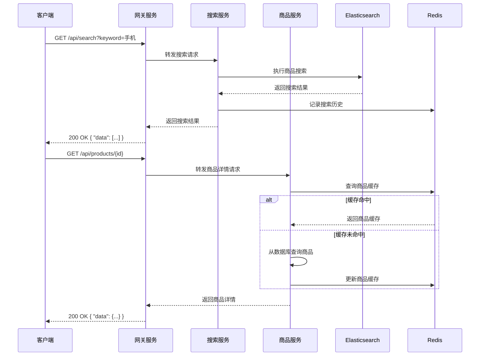
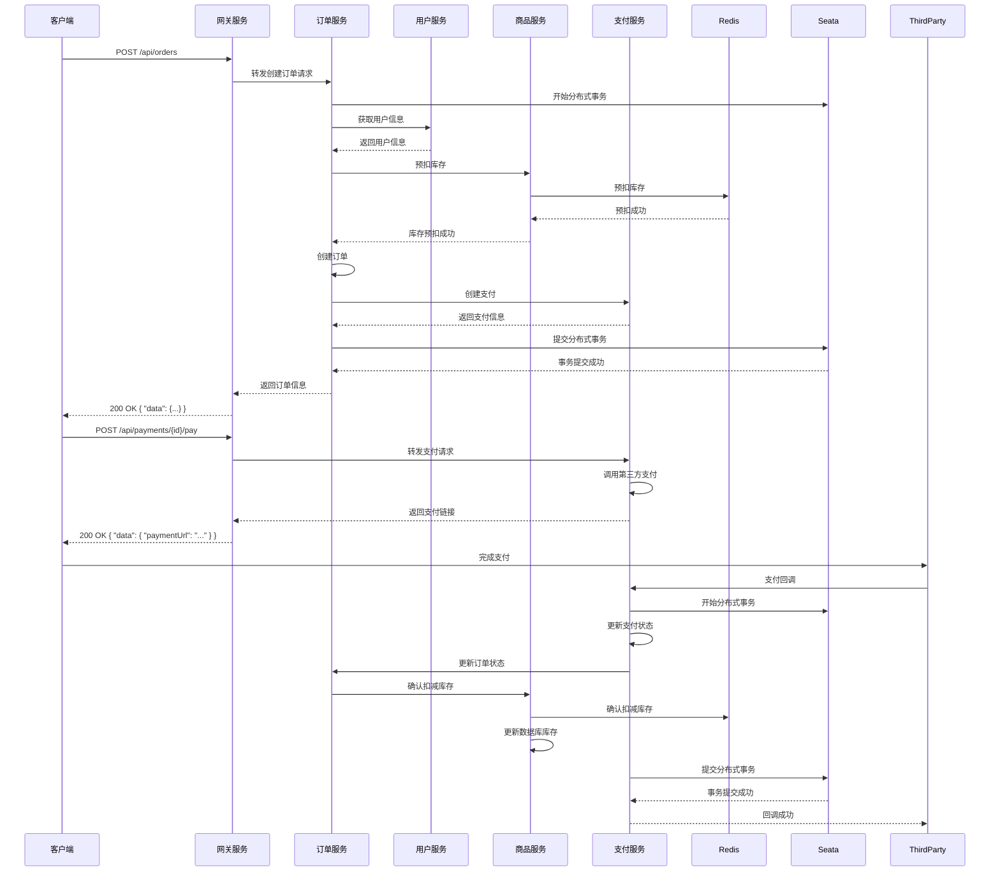
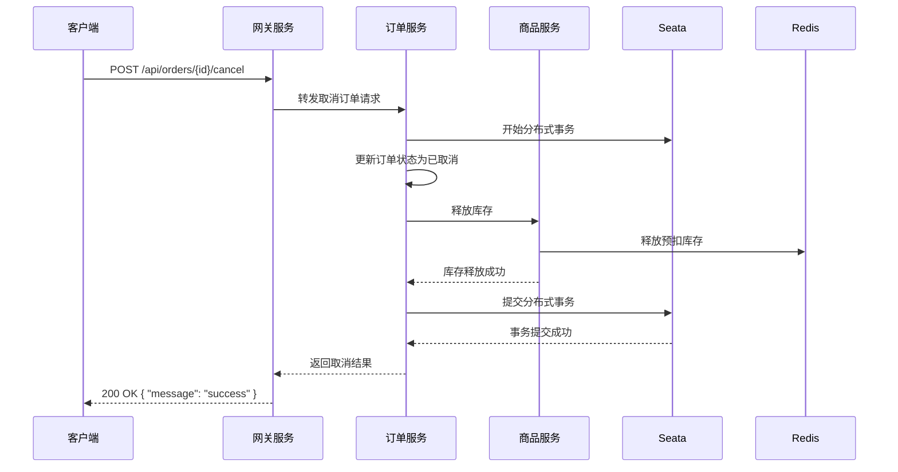
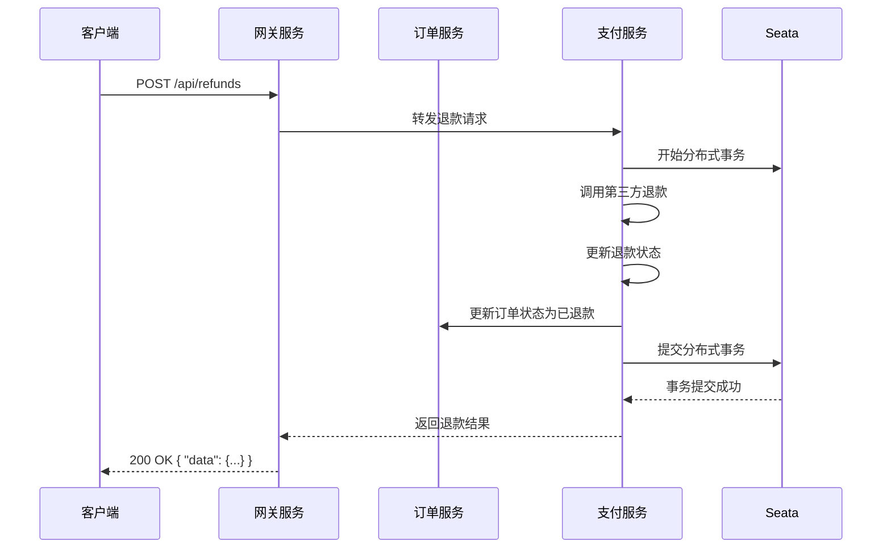

# 技术架构和集成方案文档

## 1. 整体技术架构

### 1.1 架构概述

本系统采用微服务架构设计，基于Spring Cloud Alibaba生态，实现了一个类似拼多多的电商平台。系统由多个独立的微服务组成，每个服务负责特定的业务领域，通过RESTful API进行通信。

### 1.2 架构分层

```
┌───────────────────────────────────────────────────────────────────────┐
│                             客户端层                                   │
├───────────────────────────────────────────────────────────────────────┤
│                          ┌────────────────┐                          │
│                          │   前端应用     │                          │
│                          │ (Web/Mobile)  │                          │
│                          └────────────────┘                          │
├───────────────────────────────────────────────────────────────────────┤
│                             接入层                                     │
├───────────────────────────────────────────────────────────────────────┤
│                          ┌────────────────┐                          │
│                          │   API网关     │                          │
│                          │ (Gateway)     │                          │
│                          └────────────────┘                          │
├───────────────────────────────────────────────────────────────────────┤
│                             服务层                                     │
├───────────────────────────────────────────────────────────────────────┤
│  ┌────────────────┐  ┌────────────────┐  ┌────────────────┐  ┌────────────────┐
│  │   用户服务     │  │   商品服务     │  │   订单服务     │  │   支付服务     │
│  │ (user-service) │  │ (product-service) │  │ (order-service) │  │ (payment-service) │
│  └────────────────┘  └────────────────┘  └────────────────┘  └────────────────┘
├───────────────────────────────────────────────────────────────────────┤
│                           中间件层                                     │
├───────────────────────────────────────────────────────────────────────┤
│  ┌────────────────┐  ┌────────────────┐  ┌────────────────┐  ┌────────────────┐
│  │   Nacos        │  │   Redis        │  │   Elasticsearch │  │   Seata        │
│  │ (注册/配置中心) │  │ (缓存/防超卖)  │  │ (搜索服务)     │  │ (分布式事务)   │
│  └────────────────┘  └────────────────┘  └────────────────┘  └────────────────┘
├───────────────────────────────────────────────────────────────────────┤
│                          存储层                                       │
├───────────────────────────────────────────────────────────────────────┤
│  ┌────────────────┐  ┌────────────────┐  ┌────────────────┐  ┌────────────────┐
│  │   MySQL        │  │   MySQL        │  │   MySQL        │  │   MySQL        │
│  │ (用户数据)     │  │ (商品数据)     │  │ (订单数据)     │  │ (支付数据)     │
│  └────────────────┘  └────────────────┘  └────────────────┘  └────────────────┘
└───────────────────────────────────────────────────────────────────────┘
```

### 1.3 技术栈选型

| 类别 | 技术 | 版本 | 选型理由 |
| :--- | :--- | :--- | :--- |
| 基础框架 | Spring Boot | 3.2.0 | 提供快速开发、自动配置、内嵌容器等特性，简化应用开发 |
| 微服务框架 | Spring Cloud Alibaba | 2022.0.0.0 | 提供完整的微服务解决方案，包括服务注册发现、配置中心、网关等 |
| 注册中心 | Nacos | 2.2.0 | 支持服务注册发现和配置管理，性能优异，易于集成 |
| 配置中心 | Nacos Config | 2.2.0 | 与Nacos注册中心集成，支持动态配置更新 |
| 网关 | Spring Cloud Gateway | 3.1.0 | 基于WebFlux的响应式网关，支持路由、过滤、限流等功能 |
| 分布式事务 | Seata | 1.6.0 | 轻量级分布式事务解决方案，支持AT、TCC、SAGA等模式 |
| 限流熔断 | Sentinel | 1.8.6 | 轻量级流量控制组件，支持限流、熔断、降级等功能 |
| 数据库 | MySQL | 8.0 | 稳定可靠的关系型数据库，适合存储结构化数据 |
| 缓存 | Redis | 7.0+ | 高性能内存数据库，用于缓存、会话管理、防超卖等 |
| 搜索引擎 | Elasticsearch | 8.0+ | 分布式搜索引擎，用于商品搜索、数据分析等 |
| ORM框架 | MyBatis-Plus | 3.5.0 | 增强版MyBatis，提供代码生成、分页、性能分析等功能 |
| 日志 | Logback + SkyWalking | - | Logback用于应用日志，SkyWalking用于分布式链路追踪 |
| 第三方支付 | 微信支付、支付宝 | - | 主流支付方式，覆盖大多数用户支付场景 |

## 2. 服务间集成关系

### 2.1 服务依赖关系

| 服务 | 依赖服务 | 依赖方式 | 描述 |
| :--- | :--- | :--- | :--- |
| 用户服务 | 无 | 独立服务 | 基础服务，其他服务依赖它进行用户认证 |
| 商品服务 | 无 | 独立服务 | 基础服务，提供商品信息和库存管理 |
| 订单服务 | 用户服务、商品服务、支付服务 | Feign调用 | 创建订单时需要用户信息、扣减库存、创建支付 |
| 支付服务 | 订单服务 | Feign调用 | 支付成功后需要更新订单状态 |
| 网关服务 | 所有服务 | 服务发现 | 路由请求到各个微服务 |

### 2.2 服务注册与发现

所有服务通过Nacos进行服务注册与发现：

1. 服务启动时，自动注册到Nacos注册中心
2. 服务消费者通过服务名从Nacos获取服务实例列表
3. 使用Ribbon进行客户端负载均衡

### 2.3 配置管理

所有服务的配置通过Nacos Config进行集中管理：

1. 服务启动时，从Nacos Config拉取配置
2. 配置变更时，服务自动感知并更新
3. 支持多环境配置（dev、test、prod）

## 3. 核心业务流程

### 3.1 商品浏览与搜索流程



### 3.2 订单创建与支付流程



### 3.3 订单取消流程



### 3.4 退款流程



## 4. 部署架构

### 4.1 本地开发环境

```
┌───────────────────────────────────────────────────────────────┐
│                          本地机器                              │
├───────────────────────────────────────────────────────────────┤
│  ┌────────────────┐  ┌────────────────┐  ┌────────────────┐  │
│  │   IDE          │  │   Docker       │  │   Browser      │  │
│  │ (开发工具)     │  │ (容器运行时)   │  │ (测试)         │  │
│  └────────────────┘  └────────────────┘  └────────────────┘  │
├───────────────────────────────────────────────────────────────┤
│  ┌────────────────┐  ┌────────────────┐  ┌────────────────┐  │
│  │   MySQL        │  │   Redis        │  │   Nacos        │  │
│  │ (数据库)       │  │ (缓存)         │  │ (注册/配置中心) │  │
│  └────────────────┘  └────────────────┘  └────────────────┘  │
├───────────────────────────────────────────────────────────────┤
│  ┌────────────────┐  ┌────────────────┐  ┌────────────────┐  │
│  │   用户服务     │  │   商品服务     │  │   订单服务     │  │
│  │ (8081)         │  │ (8082)         │  │ (8083)         │  │
│  └────────────────┘  └────────────────┘  └────────────────┘  │
│  ┌────────────────┐  ┌────────────────┐                      │
│  │   支付服务     │  │   网关服务     │                      │
│  │ (8084)         │  │ (8080)         │                      │
│  └────────────────┘  └────────────────┘                      │
└───────────────────────────────────────────────────────────────┘
```

### 4.2 生产环境

```
┌───────────────────────────────────────────────────────────────────────┐
│                          公网负载均衡器                                  │
├───────────────────────────────────────────────────────────────────────┤
│  ┌──────────────────────────────────────────────────────────────────┐  │
│  │                          网关集群                                  │  │
│  │  ┌────────────────┐  ┌────────────────┐  ┌────────────────┐      │  │
│  │  │   网关服务     │  │   网关服务     │  │   网关服务     │      │  │
│  │  └────────────────┘  └────────────────┘  └────────────────┘      │  │
│  └──────────────────────────────────────────────────────────────────┘  │
├───────────────────────────────────────────────────────────────────────┤
│  ┌──────────────────────────────────────────────────────────────────┐  │
│  │                          服务集群                                  │  │
│  │  ┌────────────────┐  ┌────────────────┐  ┌────────────────┐      │  │
│  │  │   用户服务     │  │   商品服务     │  │   订单服务     │      │  │
│  │  └────────────────┘  └────────────────┘  └────────────────┘      │  │
│  │  ┌────────────────┐  ┌────────────────┐  ┌────────────────┐      │  │
│  │  │   支付服务     │  │   搜索服务     │  │   营销服务     │      │  │
│  │  └────────────────┘  └────────────────┘  └────────────────┘      │  │
│  └──────────────────────────────────────────────────────────────────┘  │
├───────────────────────────────────────────────────────────────────────┤
│  ┌──────────────────────────────────────────────────────────────────┐  │
│  │                          中间件集群                                │  │
│  │  ┌────────────────┐  ┌────────────────┐  ┌────────────────┐      │  │
│  │  │   Nacos集群    │  │   Redis集群    │  │   ES集群       │      │  │
│  │  └────────────────┘  └────────────────┘  └────────────────┘      │  │
│  │  ┌────────────────┐  ┌────────────────┐                          │  │
│  │  │   Seata集群    │  │   RocketMQ集群 │                          │  │
│  │  └────────────────┘  └────────────────┘                          │  │
│  └──────────────────────────────────────────────────────────────────┘  │
├───────────────────────────────────────────────────────────────────────┤
│  ┌──────────────────────────────────────────────────────────────────┐  │
│  │                          存储集群                                  │  │
│  │  ┌────────────────┐  ┌────────────────┐  ┌────────────────┐      │  │
│  │  │   MySQL集群    │  │   MinIO集群    │  │   MongoDB集群   │      │  │
│  │  └────────────────┘  └────────────────┘  └────────────────┘      │  │
│  └──────────────────────────────────────────────────────────────────┘  │
└───────────────────────────────────────────────────────────────────────┘
```

### 4.3 容器化部署

使用Docker和Kubernetes进行容器化部署：

1. 每个服务构建为独立的Docker镜像
2. 使用Kubernetes进行容器编排
3. 配置HPA（Horizontal Pod Autoscaler）实现自动扩缩容
4. 使用Ingress进行流量管理

## 5. 技术选型理由

### 5.1 微服务框架选择

选择Spring Cloud Alibaba的理由：

1. **完整的生态体系**：提供了服务注册发现、配置中心、网关、限流熔断等全套解决方案
2. **国产化支持**：由阿里巴巴维护，对国内企业和开发者友好
3. **稳定性**：在阿里巴巴内部大规模使用，经过实战检验
4. **易于集成**：与Spring Boot无缝集成，学习曲线平缓

### 5.2 数据库选择

选择MySQL的理由：

1. **成熟稳定**：广泛使用的关系型数据库，技术成熟
2. **事务支持**：支持ACID事务，适合电商系统的资金交易
3. **生态丰富**：有大量的工具和框架支持
4. **性能优化**：通过索引、分库分表等手段可以满足高并发需求

### 5.3 缓存选择

选择Redis的理由：

1. **高性能**：内存数据库，读写速度快
2. **丰富的数据结构**：支持字符串、哈希、列表、集合、有序集合等
3. **分布式支持**：支持主从复制、哨兵模式、集群模式
4. **多功能**：可用于缓存、会话管理、分布式锁、消息队列等

### 5.4 搜索引擎选择

选择Elasticsearch的理由：

1. **全文搜索**：强大的全文搜索能力，适合商品搜索
2. **分布式架构**：支持水平扩展，处理海量数据
3. **实时性**：近实时搜索，数据更新后很快可被搜索到
4. **分析能力**：支持聚合分析，可用于数据分析和报表

### 5.5 分布式事务选择

选择Seata的理由：

1. **轻量级**：相比传统的分布式事务解决方案，更加轻量级
2. **易用性**：与Spring Cloud Alibaba无缝集成，配置简单
3. **多种模式**：支持AT、TCC、SAGA、XA等多种事务模式
4. **高性能**：通过本地事务和异步协调，提高性能

## 6. 集成测试方案

### 6.1 单元测试

每个服务都应该编写单元测试：

1. 使用JUnit 5进行单元测试
2. 使用Mockito进行依赖模拟
3. 测试覆盖率目标：核心代码≥80%

### 6.2 集成测试

使用Spring Cloud Contract进行服务间集成测试：

1. 定义消费者契约
2. 生成生产者测试
3. 验证服务间交互是否符合契约

### 6.3 端到端测试

使用Selenium或Cypress进行端到端测试：

1. 模拟用户操作流程
2. 验证完整业务流程
3. 测试关键业务场景

### 6.4 性能测试

使用JMeter或Gatling进行性能测试：

1. 测试服务在高并发下的性能
2. 测试服务的响应时间
3. 测试服务的吞吐量
4. 测试服务的稳定性

## 7. 监控和运维方案

### 7.1 监控系统

使用Prometheus + Grafana进行系统监控：

1. **服务监控**：监控服务的CPU、内存、磁盘、网络等指标
2. **JVM监控**：监控JVM的堆内存、非堆内存、GC等指标
3. **业务监控**：监控订单量、支付量、搜索量等业务指标
4. **告警配置**：设置合理的告警阈值，及时发现问题

### 7.2 日志系统

使用ELK Stack进行日志收集和分析：

1. **日志收集**：使用Filebeat收集应用日志
2. **日志存储**：使用Elasticsearch存储日志
3. **日志分析**：使用Kibana分析和查询日志
4. **日志聚合**：按服务、按时间聚合日志，便于问题排查

### 7.3 链路追踪

使用SkyWalking进行分布式链路追踪：

1. **调用链追踪**：追踪服务间的调用链路
2. **性能分析**：分析每个调用的响应时间
3. **问题定位**：快速定位性能瓶颈和错误

### 7.4 运维工具

使用以下工具进行运维：

1. **Kubernetes Dashboard**：管理Kubernetes集群
2. **Jenkins**：持续集成和持续部署
3. **Ansible**：自动化配置管理
4. **GitLab CI/CD**：代码集成和部署流水线

## 8. 安全方案

### 8.1 认证与授权

1. **JWT认证**：使用JSON Web Token进行无状态认证
2. **OAuth2**：支持第三方登录（微信、支付宝等）
3. **RBAC权限控制**：基于角色的权限控制
4. **API网关认证**：在网关层统一处理认证

### 8.2 数据安全

1. **数据加密**：敏感数据（如密码、支付信息）加密存储
2. **传输加密**：使用HTTPS进行数据传输
3. **数据库加密**：重要数据字段加密
4. **备份与恢复**：定期备份数据，确保数据安全

### 8.3 接口安全

1. **参数校验**：使用Spring Validation进行参数校验
2. **防SQL注入**：使用MyBatis的参数化查询
3. **防XSS攻击**：对用户输入进行过滤
4. **防CSRF攻击**：实现CSRF Token验证
5. **接口限流**：使用Sentinel对接口进行限流

### 8.4 第三方集成安全

1. **支付安全**：严格验证第三方支付回调签名
2. **API密钥管理**：安全存储API密钥，定期轮换
3. **IP白名单**：对敏感接口设置IP白名单

## 9. 扩展性设计

### 9.1 水平扩展

系统支持水平扩展，应对高并发：

1. **服务集群**：部署多个服务实例，通过负载均衡分发请求
2. **数据库分库分表**：当数据量达到一定规模时，进行分库分表
3. **缓存集群**：使用Redis集群，提高缓存容量和可靠性
4. **搜索引擎集群**：使用Elasticsearch集群，提高搜索性能

### 9.2 功能扩展

系统设计支持功能扩展：

1. **模块化设计**：服务内部采用模块化设计，便于功能扩展
2. **插件化架构**：核心功能采用插件化架构，便于添加新功能
3. **微服务拆分**：当业务复杂度增加时，可以进一步拆分微服务
4. **API版本管理**：支持API版本管理，便于向后兼容

### 9.3 技术扩展

系统支持技术扩展：

1. **容器化部署**：使用Docker和Kubernetes，便于快速部署和扩展
2. **云原生支持**：支持在各种云平台部署
3. **Serverless**：部分功能可以迁移到Serverless架构
4. **AI集成**：预留AI集成接口，如智能推荐、智能客服等

## 10. 总结与展望

### 10.1 系统优势

1. **架构清晰**：微服务架构，职责分明，易于维护
2. **技术先进**：采用Spring Cloud Alibaba生态，技术栈先进
3. **性能优异**：使用Redis缓存、Elasticsearch搜索，性能优异
4. **可靠性高**：分布式架构，高可用设计，可靠性高
5. **安全性强**：多层次安全设计，保障系统安全
6. **扩展性好**：支持水平扩展和功能扩展，适应业务增长

### 10.2 未来展望

1. **智能化**：集成AI技术，实现智能推荐、智能客服等功能
2. **国际化**：支持多语言、多货币，拓展国际市场
3. **生态化**：构建开放平台，引入更多合作伙伴
4. **技术创新**：探索新技术，如区块链、5G等在电商领域的应用
5. **绿色环保**：优化系统架构，降低能耗，实现绿色计算

### 10.3 实施建议

1. **分阶段实施**：按照业务优先级，分阶段实施各个服务
2. **持续集成**：建立完善的CI/CD流水线，确保代码质量
3. **监控先行**：在系统上线前，建立完善的监控体系
4. **安全审计**：定期进行安全审计，发现并解决安全问题
5. **性能优化**：持续进行性能优化，提高系统响应速度
6. **用户体验**：关注用户体验，不断优化产品功能

## 11. 附录

### 11.1 服务端口映射

| 服务 | 端口 | 上下文路径 |
| :--- | :--- | :--- |
| 用户服务 | 8081 | /user |
| 商品服务 | 8082 | /product |
| 订单服务 | 8083 | /order |
| 支付服务 | 8084 | /payment |
| 网关服务 | 8080 | / |
| Nacos | 8848 | /nacos |
| Redis | 6379 | - |
| MySQL | 3306 | - |
| Elasticsearch | 9200 | - |
| Kibana | 5601 | - |
| Prometheus | 9090 | - |
| Grafana | 3000 | - |

### 11.2 核心配置文件

#### 网关服务配置 (`application.yml`)

```yaml
spring:
  application:
    name: gateway-service
  cloud:
    nacos:
      discovery:
        server-addr: localhost:8848
    gateway:
      routes:
        - id: user-service
          uri: lb://user-service
          predicates:
            - Path=/user/**
        - id: product-service
          uri: lb://product-service
          predicates:
            - Path=/product/**
        - id: order-service
          uri: lb://order-service
          predicates:
            - Path=/order/**
        - id: payment-service
          uri: lb://payment-service
          predicates:
            - Path=/payment/**

server:
  port: 8080
```

### 11.3 开发环境搭建

1. **安装Docker**：用于运行中间件服务
2. **启动中间件**：使用Docker Compose启动MySQL、Redis、Nacos等
3. **配置IDE**：在IDE中导入各个服务的代码
4. **启动服务**：按顺序启动各个微服务
5. **测试验证**：使用Postman或浏览器测试API

### 11.4 常用命令

#### 启动中间件

```bash
# 启动MySQL、Redis、Nacos
docker-compose up -d

# 查看中间件状态
docker-compose ps
```

#### 构建服务

```bash
# 构建所有服务
mvn clean package -DskipTests

# 构建单个服务
cd user-service
mvn clean package -DskipTests
```

#### 启动服务

```bash
# 启动用户服务
java -jar user-service/target/user-service-1.0.0.jar

# 启动商品服务
java -jar product-service/target/product-service-1.0.0.jar

# 启动订单服务
java -jar order-service/target/order-service-1.0.0.jar

# 启动支付服务
java -jar payment-service/target/payment-service-1.0.0.jar

# 启动网关服务
java -jar gateway-service/target/gateway-service-1.0.0.jar
```

### 11.5 故障排查

1. **查看日志**：检查应用日志，定位问题
2. **监控面板**：查看Grafana监控面板，了解系统状态
3. **链路追踪**：使用SkyWalking查看调用链路，定位性能瓶颈
4. **数据库检查**：检查数据库连接、SQL执行情况
5. **缓存检查**：检查Redis缓存状态，确保缓存正常

---

**文档版本**：v1.0
**编写日期**：2026-02-24
**编写人**：System Designer